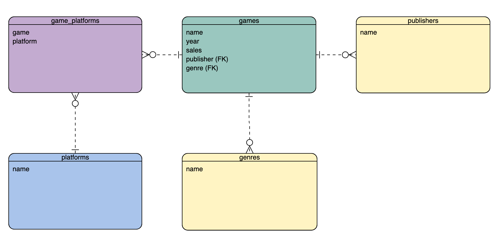

# Video Game Sales Dataset
## Description
- The video game sales has a list of the best selling video games, platform specific. For example, Grand Theft Auto V was released on PC, PS3, PS4, xBox 360, xBox One, etc. but there are entries in the dataset for each. Using a GamePlatforms table could let me use the total sales to generate the list, rather than using the defined list order. Game titles would have to not be unique.

## Dataset Columns
- Rank:int
- Name:string
- Platform:string
- Genre:string
- Publisher:string
- NA_Sales:decimal
- EU_Sales:decimal
- JP_Sales:decimal
- Other_Sales:decimal
- Global_Sales:decimal

## Tables
### Games
- Rank
- Name
- Platform (FK)
- Year
- Genre (FK)
- Publisher (FK)
- Global_Sales
### Platforms
- Name
### Genres
- Name
### Publishers
- Name
### GamePlatforms
- game
- platform

## Views
### Games
- index
    - show a list of all games ranked from highest to lowest 'Global Sales' from the data
- show
    - show a specific game with its coresponding information
### Platforms
- index
    - show a list of all the platforms
- show
    - show a specific platform and all games for it
### Genres
- index
    - show a list of all the genres
- show
    - show a specific genre and all games that belong to it
### Publishers
- index
    - show a list of all the publishers
- show
    - show a specific publisher and all the games they published

## Video Game ERD
